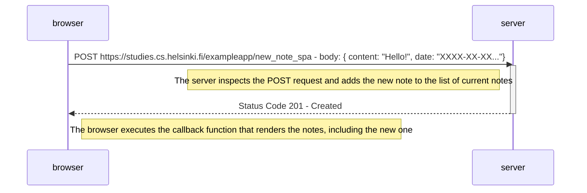

```mermaid
    sequenceDiagram
        participant browser
        participant server

        browser->>server: POST https://studies.cs.helsinki.fi/exampleapp/new_note_spa - body: { content: "Hello!", date: "XXXX-XX-XX..."} 
        activate server
        Note left of server: The server inspects the POST request and adds the new note to the list of current notes
        server-->>browser: Status Code 201 - Created
        deactivate server

        Note right of browser: The browser executes the callback function that renders the notes, including the new one
```